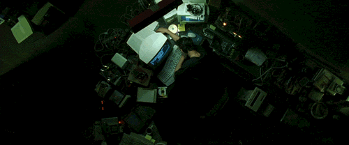

## Hi, I'm [Mubtasim!](https://mubtasimahasan.github.io/)

  

  

I’m researching **audio and speech tokenization and synthesis**, **multimodal learning**, **representation learning and alignment**, and **AI agents**.  

I'm working as a Research Assistant (post-bachelor RA) at the **Center for Computational & Data Sciences (CCDS), Independent University, Bangladesh (IUB)**.  

I'm seeking PhD opportunities and would love to collaborate on interesting ideas. Feel free to reach me at **mubtasimahasan at gmail dot com**.
